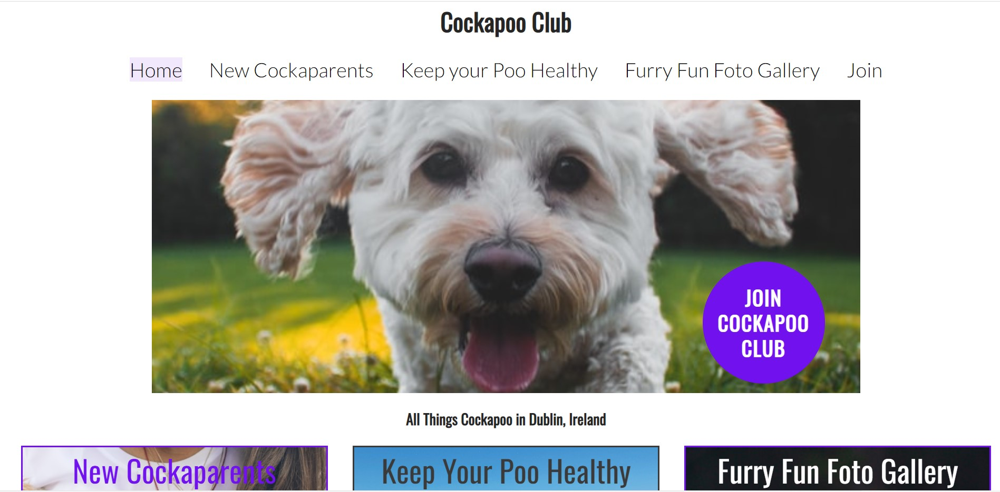
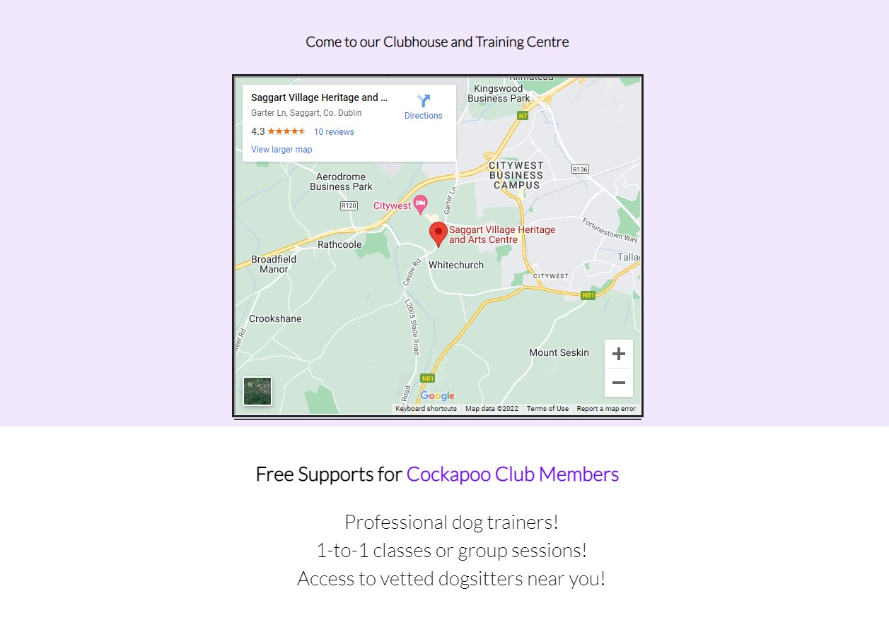
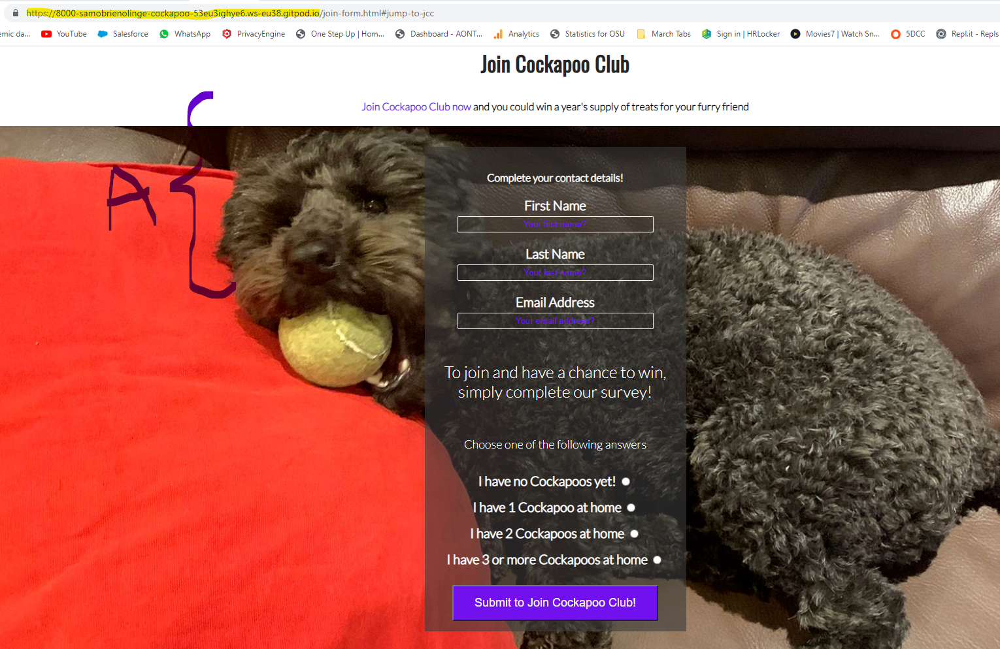
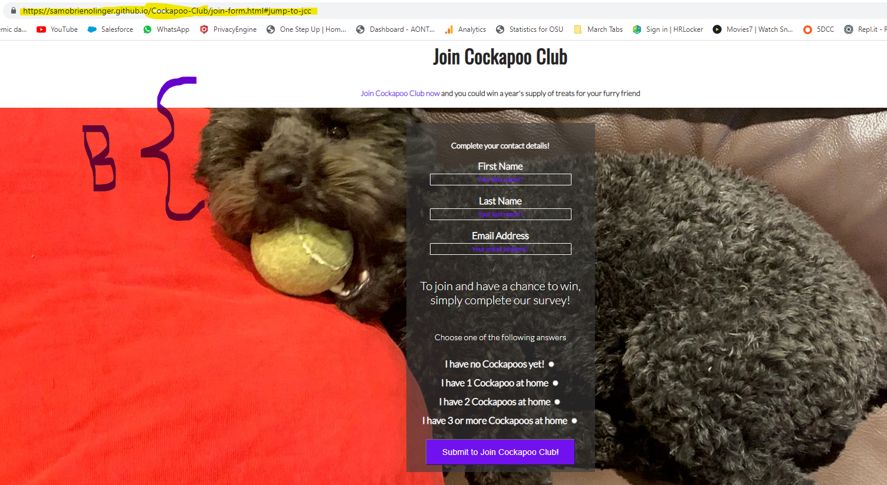

# Cockapoo Club

This website provides users with a starting point for all kinds of information about owning Cockapoos, one of Ireland's newest, most popular and much-loved dog breeds. Unlike many other websites that provide similar information this project offers users a unique opportunity to create and particapte in their own club and community in person.  

The site targets users in Dublin, Ireland who

* may already have a Cockapoo dog and need more information about taking care of their dog. 

* may be thinking about getting a new Cockapoo dog and require more information to make their decision. 

Perhaps most importantly, what makes this website stand out from other websites that provide useful information about this dog breed and becoming a new owner; is how i ttargets users who 

* may already be Cockapoo owners and are interested in connecting with and learning from other Cockapoo owners, by joining their own unique community, meeting face-to-face, sharing photographs of their pet and training their dogs together.   

## **Features**

The webiste consists of five webapges:

* [Homepage](#homepage)
* [New Cockaparents](#new-cockaparents)
* [Keep Your Poo Healthy](#keep-your-poo-healthy)
* [Furry Fun Foto Gallery](#furry-fun-foto-gallery)
* [Join](#join-page)

### **[Homepage](#homepage)** 

  - The landing page immedaitely engages the user with a large [hero image](#hero-image) that zooms forward. The image is of a friendly happy Cockapoo running towards you with excitement. The zoom forward therefore aims to remind the user of this real life situation, in order to illicit a positive emoitional respons from the user from the very start of their experience on the website.  

  #### **Navigation Bar**

      - Featured on all five pages, the full responsive navigation bar includes links to the Logo, Home page and all other pages. The navigation bar is identical in each page to allow for easy navigation.
      - This section will allow the user to easily navigate from page to page across all devices without having to revert back to the previous page via the ‘back’ button. Each page has a feature that tells the user which page they are via the specific page the user is on having the correpsonding navigation bar option bakcground highlighted: 

       

      
  #### **[Hero image](#hero-image)**

  - The hero image and also has cover text of JOIN COKCAPOO CLUB with an immediate call to action which brings the user to the Join page in order to encourage the user to sign up and become a member of this unique community. 
  
   

  - To avoid the 'illusion of completeness' there are images visible above the fold area:

     

  #### **Content on Homepage**

  - The main element is divided into three sections with different purposes and value for the user, depending on what kind of information they are looking for. 
  
   - Free-to-use background images were used for each of the three main options that bring the user to a new page within the website: 
  
     - [New Cockaparents](https://samobrienolinger.github.io/Cockapoo-Club/new-cockaparents.html#jump-to-nc)
   
      - [Keep Your Poo Healthy](https://samobrienolinger.github.io/Cockapoo-Club/keep-your-poo-healthy.html#jump-to-kyph) 
    
       - [Furry Fun Foto Gallery](https://samobrienolinger.github.io/Cockapoo-Club/furry-fun-foto-gallery.html#jump-to-fffg)   

   - After these main pieces of content, there is an area with a map and information about the clubhouse and training centre, as well as another call to action to join Cockapoo Club with two hyperlinked pieces of text to give users even more opportunities to visit the [Join](#join-page) page and submit their contact details. A chance to win a prize is also available on the Join page and aims to further encourage new members to join.
   
   - An embedded map to the clubhouse and training centre is also provided for users to locate Cockapoo Club's premises along with opening times for the clubhouse and training centre. 
   
   - A list of free suports are also outlined to encourage users to visit and socialise with others in this special community, making this project stand out from other simalr websites that may provide similar information about Coakapoos and other pets. The value of this content to the user is the list it provides of the main benefits to becoming a new member and particapting in person

       

  ### **[New Cockaparents](#new-cockaparents)**

   

  - For people who will become cockapoo owners for the first time the [New Cockaparents](https://samobrienolinger.github.io/Cockapoo-Club/new-cockaparents.html#jump-to-nc) webpage provides the user with a starting point for learning more about becoming a new owner of a Cockapoo, with evidence-based information linking to credible sources on other webistes which help new owners plan and adjust to their new member of the family. 

  - To ensure a positive user expereince, all internal links to this webpage bring the user to a specific point lower down the page when they land with a familiar image and heading consistent with the option they chose on the homepage that matches their expectations. This feature is applied across the entire website.  

### **[Keep Your Poo Healthy](#keep-your-poo-healthy)**

  

  - For people who want to learn more about maintaining their pet's wellbeing, there is the section called 'Keep your Poo healthy'. [Keep Your Poo Healthy](https://samobrienolinger.github.io/Cockapoo-Club/keep-your-poo-healthy.html#jump-to-kyph) provides the user with a starting point for finding out more infomration about taking good care of a Cockapoo, with evidence-based information linking to credible sources on other webistes to help owners take care of the health needs of their pet.

  - Similar to the New Cockaparents page, the same features were applied regarding internal links and landing on this new page that guarantee consistency while meeting the user's need for familairity and expectations of engaging with new content. 

### **[Furry Fun Foto Gallery](#furry-fun-foto-gallery)**

  

  - The [Furry Fun Foto Gallery](https://samobrienolinger.github.io/Cockapoo-Club/furry-fun-foto-gallery.html#jump-to-fffg) section is intended for users to peruse and upload images of their pets. This section provides a gallery of shared images.

  - After researching other websites and social media that provide dog owners with relevant valuable information, it was clear that dog owners enjoy being part of a community with this same shared interest in their pets. Joining a unique online collective is a priority for many users who love to see images of other people's pets and want to share images and information about their own pet and personal experiences.

  - This photo gallery idea was borrowed from the Love Running Project, which also seemed to capture the demand of users to particapte in an online setting with other likeminded users through sharing relvant images. This feature aims to add more value to the overall educational and informative purpose of the site.   

### **[Join](#join-page)**

   

  - An important feature of the website that provides value for users is the opportunity to become a member of Cockapoo Club. The [Join](https://samobrienolinger.github.io/Cockapoo-Club/join-form.html#jump-to-jcc) page encourages users to submit some basic details via the short survey to automatically receive free membership. Users are also entered into a new members prize draw. This feature was inspired by the Code Institute's Coders Coffeehouse example.    

  - This builds on the concept outlined in the abovesection regarding the clubhouse and training centre as well as the Furry Fun Foto Gallery.  A physical space where Cockapoo owners and their pets can meet in person. The opportunity to meet and benefit membership in-person makes this website and concept different to most other purely online communities that can easily be found on social media platforms yet do not involve members meeting face-to-face with their pets for mutual benefit and free peer-support.   

### **The Footer** 

   

  - The footer section includes links to the relevant social media sites which would connect users with social media for Cockapoo Club. The links open to a new tab to allow easy navigation for the user.

  - The footer is valuable to the user as it encourages them to stay connected with their community and fellow Cokcapoo Club members via social media.

   - The footoer also contains an email address to contact Cockapoo Club and another call to action to join as a new member. 

   - The icons for the footer  were taken from [Font Awesome](https://fontawesome.com/)

## **Deployment**

- The site was deployed to GitHub pages using the following steps:

  - In the GitHub repository, navigate to the Settings tab 
  - From the source section drop-down menu, select the Master Branch
  - Once the master branch has been selected, the page will be automatically refreshed with a detailed ribbon display to indicate the successful deployment. 

  - The live link can be found [Here](https://samobrienolinger.github.io/Cockapoo-Club/index.html) 

## **Features Left to Implement**

- Two other ideas for future features include: 

  - a way for users who would join Cockapoo CLub to upload their photographs of their pets. 

  - a live chat feed visible in the Furry Fun Foto Gallery page where members only would comment on other members photographs and be able to share more information in real-time with each other. 

  - a training video gallery for members to post their videos of progress they are making in training their pets. 

## **Testing**
 - This website works on screens sizes of minimum width 320px. I wanted it to work for smaller screen-sizes such as smaller mobiles, so future media queries will be added for screens of maximimum width 320px.     
 
 - **Validator Testing**

   - HTML

     X

   - CSS

    Y

   - Lighthouse 
     
      - Mobile
      screenshot
    
      - Desktop 
      screenshot
      
## **Unfixed Bugs**

  - There seems to be a minor difference between how the background image renders in the join-form.html page via **(A)** the Gitpod remote explorer [Here](https://8000-samobrienolinge-cockapoo-53eu3ighye6.ws-eu38.gitpod.io/join-form.html#jump-to-jcc) and **(B)** the same deployed webapge [Here](https://samobrienolinger.github.io/Cockapoo-Club/join-form.html#jump-to-jcc) in Google Chrome (please see images below). Microsoft Edge and Mozilla browsers render as normal/image A below.   

      **(A)**

      

      **(B)**

      

  - In making the project responsive, it was suggested to me that I use flexbox. However, having not covered this in the modules I found that in trying to implenet flexbox this ultimately resulted in over-complicating issues for ensuring responsiveness. I spent far too much time trying to learn about and apply flexbox to all areas of the site which was not really necessary. With support from Code Institute tutors, I was eventually able to undo the areas of code that were causing the most problems for responsiveness. 

  - Another issue faced in making the site more responsive was making sure to use dynamic units of measurement rather than fixed ones in the most appropriate places.  

  - There were two occasions where I expereinced conflicts between my GitHub repository and my local one. I was unaware that having more than one gitpod workspace open would casue signifcant issues with diverging main branches. A signficant amount of time was sepnt on these occasions with Code Institute tutors fixing the conflicts that came with having to merge or reconcile branches.  

  - significant bugs were also experienced when Github moved servers from eu34 to eu38, before I saved my progress, resulting in losing a significant number of hours of work over approximately a weeks. Code Institute tutors were very helpful with guiding me through the procedure for finding the last git push I had done and restoring that.      

## **Credits**

As a starting point I began with the html and css structure used in Code Institute's Love Running Project. I did this mainly because I thought the hero image with zoom was a great way to engage a new user. I also wanted to have a feature that allowed users to 'join' a club, so the Love Running project provided a good blueprint for adapting to the concpet of a Cockapoo Club community.  

### **Code**

  - code for the opening times of the Cockapoo CLubhouse and Traininge Centre was initally taken from the Code Institute's Coders Coffeehouse practical examples and styled differnetly in CSS later: 

    <h3>Open times</h3>

    <table>
      <tr>
        <th></th>
        <th>Open</th>
        <th>Close</th>	
      </tr>
      <tr>
        <td>Mon - Fri</td>
        <td>09:00</td>
        <td>21:00</td>
      </tr>
      <tr>
        <td>Weekend</td>
        <td>10:00</td>
        <td>22:00</td>
      </tr>	
    </table>

### **Content**

   - information and text was gathered from the following websites:

      - [zigzag.dog](https://zigzag.dog/guide-how-to-train-cockapoo-puppy/)
      - [Hillspet](https://www.hillspet.com/new-pet-parent/dog#faqs)
      - [Wikipedia](https://en.wikipedia.org/wiki/Cockapoo) 
      - [YouTube](https://youtu.be/Fe-sa9mHcxI )

  - Styling and instructions on how to construct form validation on the join-form.html page was based on the form found in the Code Institute Love Running Project module: [Signup Form: Challenge 1](https://learn.codeinstitute.net/courses/course-v1:CodeInstitute+LR101+2021_T1/courseware/4a07c57382724cfda5834497317f24d5/4d85cd1a2c57485abbd8ccec8c00732c/?child=first). 

- The icons in the footer were taken from [Font Awesome](https://fontawesome.com/)

- Technologies used include: 
     
    - HTML5
    - CSS3
    - Python3
    - [Convertio](https://convertio.co/) was used to convert images from .jfif and .jpeg to .png for improved performance 

    - Gitpod
    - Github
    - Gitbash
    - Google Chrome DevTools 

      
     - Font-awesome ("Font Awesome 5 Brands")  
     - @font-face / @import url('https://fonts.googleapis.com/css2?family=Lato:wght@300&family=Oswald&display=swap')
     - @keyframes hero-zoom 
     - @media screen and (max-width: 800px)
     - Prefixed by https://autoprefixer.github.io
        * PostCSS: v8.3.6,
        * Autoprefixer: v10.3.1
        * Browsers: last 4 version 

  - Languages used: 
      - HTML5
      - CSS3
      - ?python3?
   
 - **Images**

    - The photos used on the main pages are from various open source sites. The background image for join-form.html is my own. The other images on the main pages were sourced from the following places:

      - Hero image: [unsplash](https://unsplash.com/photos/KVeogBZzl4M) 
      - new cockaparents: [unsplash](https://unsplash.com/photos/T2ld_5QnZBQ) 
      - Keep your Poo Healthy: [pixabay](https://pixabay.com/photos/beach-dog-ball-cockapoo-puppy-2427290/) 
      - Furry Fun: [pixabay](https://pixabay.com/photos/beach-dog-water-sea-reflection-2239428/)
      
     - Images for the [Furry Fun Foto Gallery](https://samobrienolinger.github.io/Cockapoo-Club/furry-fun-foto-gallery.html#jump-to-fffg) are a combination of my own and others found on the following sites:

        - [pxfuel](https://www.pxfuel.com/en/search?q=Cockapoo)
        - [ukpets](https://www.ukpets.com/blog/how-much-is-a-cockapoo) 

 - **Video**

    - The YouTube video embedded in keep-your-poo-healthy.html was taken from https://www.hillspet.com: https://youtu.be/Fe-sa9mHcxI 

## **Acknowledgements**

   - The README template provided by Code Institute was very helpful as a model for developing this README file: https://github.com/Code-Institute-Solutions/readme-template 

   - My mentor, as well as a number of Code Institute Tutors and students were very suportive via slack and the Student Support Chat. The following people helped guide me and to tease out a range of issues I faced developing the project: 
     
      - sandeep_mentor
      - DavidK_5P
      - David Bowers_5p_lead
      - Eventyret_mentor
      - Ionut Ciobanu
      - Franciska 
      - Sean
      - Ger
      - Christine
      - Rebecca

