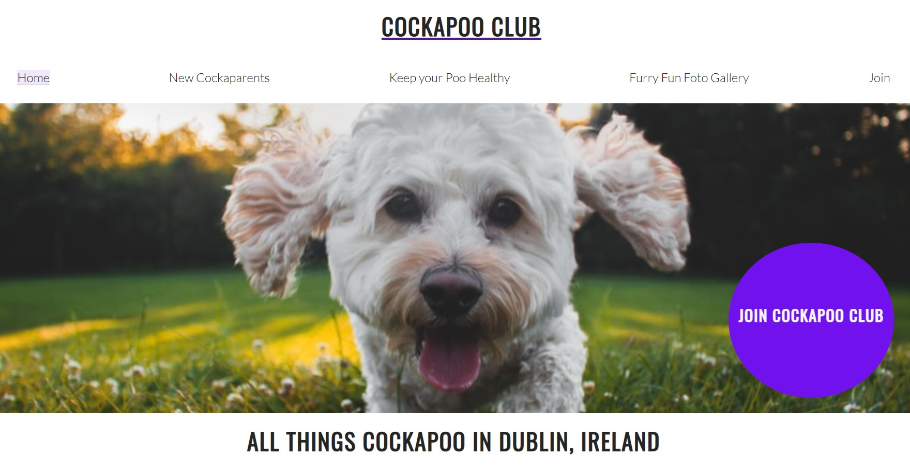
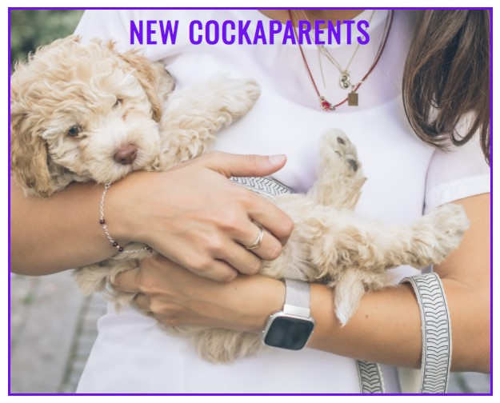
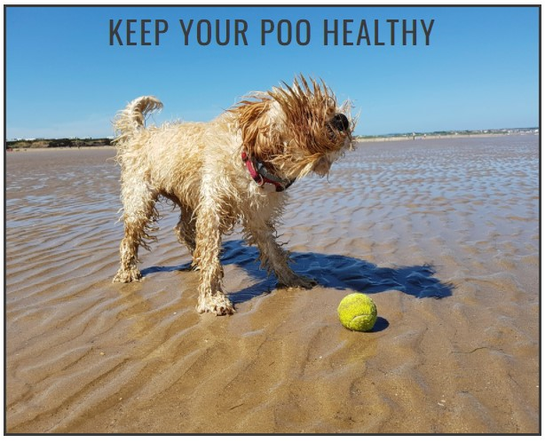
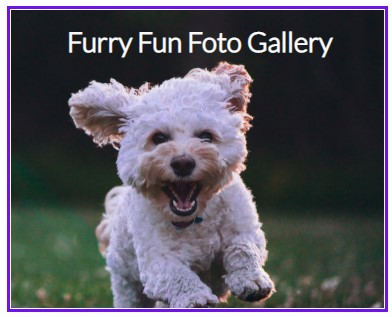
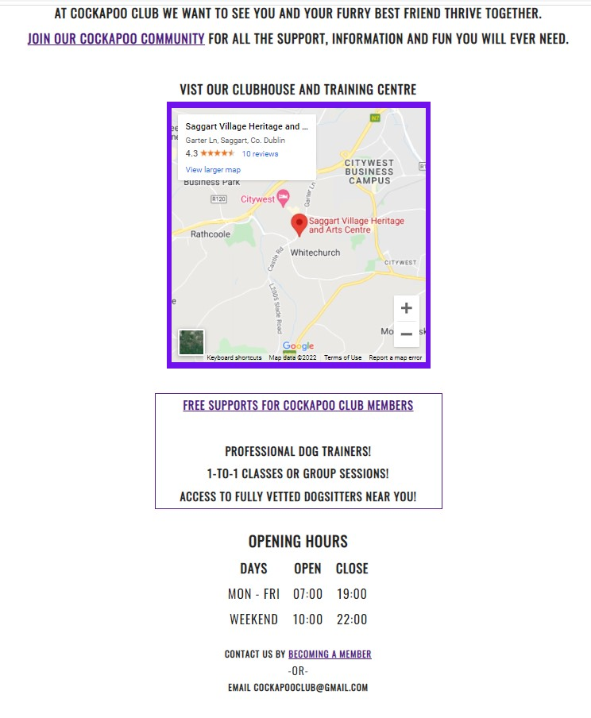

# Cockapoo Club

This website provides users with a starting point for all kinds of information about owning Cockapoos, one of Ireland's newest, most popular and much-loved dog breeds.

The site targets people in Ireland 

* Who already have a Cockapoo dog and need more information about taking care of their dog. 

* Who are thinking about getting a new Cockapoo dog and require more information to make their decision. 

* Who are already Cockapoo owners interested in connecting with and learning from other Cockapoo owners, by joining their own unique community.  

### **Features**

The webiste consists of five webapges:

* Home
* New Cockaparents
* Keep Your Poo Healthy
* Furry Fun Foto Gallery
* Join
* Footer

- __Homepage__

  - The landing page immedaitely engages the user with a large hero image that zooms forward. The image is of a friendly happy Cockapoo running towards you with excitement. The zoom forward therefore aims to remind the user of this realifesituation in order to illicit a positive emoitional respons from the user from the very start of their experience on the website.  

- __Navigation Bar__

  - Featured on all five pages, the full responsive navigation bar includes links to the Logo, Home page and all other pages. The navigation bar is identical in each page to allow for easy navigation.
  - This section will allow the user to easily navigate from page to page across all devices without having to revert back to the previous page via the ‘back’ button. Each page has a feature that tells teh user which page they are via the specific page the user is on having the correpsonding navigation bar option bakcground highlighted: 

     

- __Hero image__

  - The hero image and also has cover text of >JOIN COKCAPOO CLUB with an immediate call to action which brings the user to the Join page in order to encourage the user to sign up and become a member of this unique community. 

        

  - To avoid the illusion of completeness there are images visible above the fold area:

     

- __Content on Home page__

  - The main element is divided into three sections with different purposes and value for the user, depending on what kind of information they are looking for. 
  
   - Free to use background images were used for each of the three main options that bring the user to a new page within the website: 
  
     - [New Cockaparents](https://8000-samobrienolinge-cockapoo-ovrr1eu3z5g.ws-eu34.gitpod.io/new-cockaparents.html#jump-to-nc)

        
   
      - [Keep Your Poo Healthy](https://8000-samobrienolinge-cockapoo-ovrr1eu3z5g.ws-eu34.gitpod.io/keep-your-poo-healthy.html#jump-to-kyph) 

          
    
       - [Furry Fun Foto Gallery](https://8000-samobrienolinge-cockapoo-ovrr1eu3z5g.ws-eu34.gitpod.io/furry-fun-foto-gallery.html#jump-to-fffg).     

          

   - After these main pieces of content, there is an area with a map and information about the clubhouse and training centre, as well as another call to action to join Cockapoo Club with two hyperlinked pieces of text to give users more opportunities to visit the Join page and submit their contact details to win a prize. The value of this content to the user is the list it provides of the main benefits to becoming a new member. An embedded map to the clubhouse and training centre is also provided for users to locate Cockapoo Club's premises and encourage them to visit and socialise with others in this special community:

       

- __New Cockaparents page__

    

  - For people who will become cockapoo owners for the first time the [New Cockaparents](https://8000-samobrienolinge-cockapoo-ovrr1eu3z5g.ws-eu34.gitpod.io/new-cockaparents.html#jump-to-nc) webapge provides the user with a starting point for learning more about becoming a new owner of a Cockapoo, with evidence-based information linking to credible sources on other webistes which help new owners plan and adjust to their new member of the family. 

  - To ensure a positive user expereince, all internal links to this webpage bring the user to a specific point lower down the page when they land with a familiar image and heading consistent with the option they chose on the homepage that matches their expectations. This feature is applied across the entire website.  

- __Keep Your Poo Health page__

    

  - For people who want to learn more about maintaining their pet's wellbeing, there is the section called 'Keep your Poo healthy'. [Keep Your Poo Healthy](https://8000-samobrienolinge-cockapoo-ovrr1eu3z5g.ws-eu34.gitpod.io/keep-your-poo-healthy.html#jump-to-kyph) provdes the user with a starting point for finding out more infomration about taking good care of a Cockapoo, with evidence-based information linking to credible sources on other webistes to help owners take care of the health needs of their pet.

  - Similar to the New Cockaparents page, the same features were applied regarding internal links and landing on this new page that guarantee consistency while meeting the user's need for familairity and expectations of engaging with new content. 

- __Furry Fun Foto Gallery page__

    

  - The 'Furry Fun' section is for users to peruse and upload images of their pets. This section provides a gallery of shared images.

  - After researching other websites and social media that provide dog owners with relevant valuable information, it was clear that dog owners enjoy being part of a community with this same shared interest in their pets. Joining a unique online collective is a priority for many users who love to see images of other people's pets and want to share images and information about their own pet and personal experiences.

  - This photo gallery idea was borrowed from the Love Running Project, which also seemed to capture the demand of users to particapte in an online setting with other likeminded users through sharing relvant images. This feature aims to add more value to the overall educational and informative purpose of the site.   

- __Join page__

    

  - An important feature of the website that provides value for users is the opportunity to become a member of Cockapoo Club. The [Join](https://8000-samobrienolinge-cockapoo-ovrr1eu3z5g.ws-eu34.gitpod.io/join-form.html#jump-to-jcc) page encourages users to submit some basic details via the short survey to automatically receive free membership. Users are also entered into a new members prize draw. This feature was inspired by the Code Institute's Coders Coffeehouse example.    

  - This builds on the concept outlined in the abovesection regarding the clubhouse and training centre as well as the Furry Fun Foto Gallery.  A physical space where Cockapoo owners and their pets can meet in person. The opportunity to meet and benefit membership in-person makes this website and concept different to most other purely online communities that can easily be found on social media platforms yet do not involve members meeting face-to-face with their pets for mutual benefit and free peer-support.   

- __The Footer__ 

     

  - The footer section includes links to the relevant social media sites which would connect users with social media for Cockapoo Club. The links open to a new tab to allow easy navigation for the user.

  - The footer is valuable to the user as it encourages them to stay connected with their community and fellow Cokcapoo Club members via social media.

   - The footoer also contains an email address to contact Cockapoo Club and another call to action to join as a new member. 

### **Features Left to Implement**

- Two other ideas for future features include: 

  - a live chat feed visible in the Furry Fun Foto Gallery page where members only would comment on other members photographs and be able to share more information in real-time with each other. 

  - a training video gallery for members to post their videos of progress they are making in training their pets. 

### **Testing**

 - __Validator Testing__

   - HTML

     X

   - CSS

    Y

- __Unfixed Bugs__

Cedits:

As a starting point I began with the html and css structure used in Code Institute's Love Running Project. I did this mainly because I thought the hero image with zoom was a great way to engage a new user. I also wanted to have a feature that allwoed users to 'join' a club, so the Love Running project provided a good blueprint for adapting to Cockapoo Club. 

### **Deployment**

- The site was deployed to GitHub pages using the following steps:

  - In the GitHub repository, navigate to the Settings tab 
  - From the source section drop-down menu, select the Master Branch
  - Once the master branch has been selected, the page will be automatically refreshed with a detailed ribbon display to indicate the successful deployment. 

The live link can be found here: /*   */

### **Credits**

 - __Content__

   - information and text was gathered from the following websites:

      - https://zigzag.dog/guide-how-to-train-cockapoo-puppy/ 
      - https://www.hillspet.com/new-pet-parent/dog#faqs
      - https://en.wikipedia.org/wiki/Cockapoo 
      - https://youtu.be/Fe-sa9mHcxI 

    - Instructions on how to construct form validation on the join-form.html page was taken from the Code Institute Love Running Project module. 

- The icons in the footer were taken from [Font Awesome](https://fontawesome.com/)

### Media

- The photos used on the home and sign up page are from This Open Source site
- The images used for the gallery page were taken from this other open source site

   - Technologies used include: 
   
     - Font-awesome ("Font Awesome 5 Brands")    
     - @font-face / @import url('https://fonts.googleapis.com/css2?family=Lato:wght@300&family=Oswald&display=swap')
     - @keyframes hero-zoom 
     - @media screen and (max-width: 800px)
     - Prefixed by https://autoprefixer.github.io
        * PostCSS: v8.3.6,
        * Autoprefixer: v10.3.1
        * Browsers: last 4 version   

 - __Images__

   - Hero image: https://unsplash.com/photos/KVeogBZzl4M 
   - new cockaparents: https://unsplash.com/photos/T2ld_5QnZBQ 
   - Keep your Poo Healthy: https://pixabay.com/photos/beach-dog-ball-cockapoo-puppy-2427290/ 
   - Furry Fun: https://pixabay.com/photos/beach-dog-water-sea-reflection-2239428/ 

 - __Video__

    - The YouTube video embedded in keep-your-poo-healthy.html was taken from https://www.hillspet.com: https://youtu.be/Fe-sa9mHcxI 

 - __Acknowledgements__

   - The README template provided y Code Institute was very helpful as a model for developing this README file: https://github.com/Code-Institute-Solutions/readme-template 

   - A number of Code Institute Tutors and students were very suportive via slack and the Student Support Chat: 
     
     - DavidK_5P
     - David Bowers_5p_lead
     - Eventyret_mentor
     - Ionut Ciobanu
